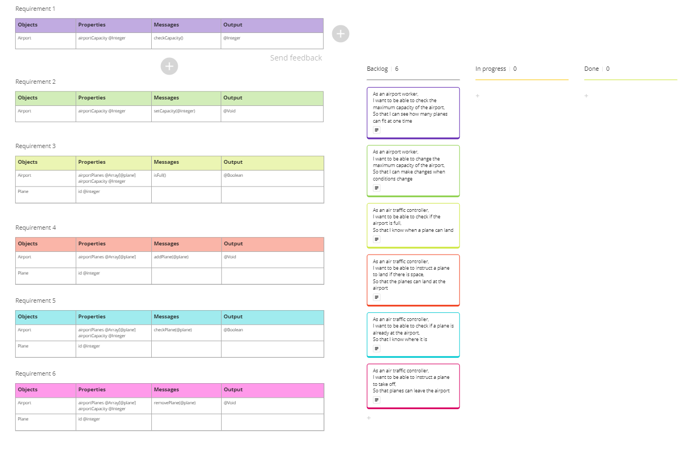

# Domain Models and Test Plan

## User stories

1. As an airport worker,
I want to be able to check the maximum capacity of the airport,
So that I can see how many planes can fit at one time.

2. As an airport worker,
I want to be able to change the maximum capacity of the airport,
So that I can make changes when conditions change.

3. As an air traffic controller,
I want to be able to check if the airport is full,
So that I know when a plane can land.

4. As an air traffic controller,
I want to be able to instruct a plane to land if there is space,
So that the planes can land at the airport.

5. As an air traffic controller,
I want to be able to check if a plane is already at the airport,
So that I know where it is.

6. As an air traffic controller,
I want to be able to instruct a plane to take off,
So that planes can leave the airport.

----------------------------------

## Domain models

**User Story 1**
| Objects | Properties               | Messages        | Output   |
|---------|--------------------------|-----------------|----------|
| Airport | airportCapacity @Integer | checkCapacity() | @Integer |

 

**User Story 2**
| Objects | Properties               | Messages              | Output |
|---------|--------------------------|-----------------------|--------|
| Airport | airportCapacity @Integer | setCapacity(@integer) | @Void  |

 

**User Story 3**
| Objects | Properties                                              | Messages | Output   |
|---------|---------------------------------------------------------|----------|----------|
| Airport | airportCapacity @Integer / airportPlanes @Array[@plane] | isFull() | @Boolean |
| Plane   | id @string                                              |          |          |

 

**User Story 4**
| Objects | Properties                   | Messages         | Output |
|---------|------------------------------|------------------|--------|
| Airport | airportPlanes @Array[@plane] | addPlane(@plane) | @Void  |
| Plane   | id @string                   |                  |        |

 

**User Story 5**
| Objects | Properties                                              | Messages     | Output   |
|---------|---------------------------------------------------------|--------------|----------|
| Airport | airportCapacity @Integer / airportPlanes @Array[@plane] | checkPlane() | @Boolean |
| Plane   | id @string                                              |              |          |

 

**User Story 6**
| Objects | Properties                                              | Messages      | Output |
|---------|---------------------------------------------------------|---------------|--------|
| Airport | airportCapacity @Integer / airportPlanes @Array[@plane] | removePlane() | @Void  |
| Plane   | id @string                                              |               |        |

----------------------------------------------------------

 

 

-----------------------------------------------------------

## Additional Features

**User Story 7**

As an air traffic controller,
I want to ensure that planes cannot land during stormy weather conditions,
So that I can maintain safety protocols and prevent accidents.

**User Story 8**

As an air traffic controller,
I want to ensure that planes cannot take off during stormy weather conditions,
To mitigate the risk of accidents and ensure passenger safety.

-----------------------------------------------------------

**Domain Model - User Story 7**

| Objects | Properties        | Messages       | Output   |
|---------|-------------------|----------------|----------|
| Airport |                   | checkWeather() | @Boolean |
| Weather | isStormy @Boolean |                |          |

**Domain Model - User Story 7**

| Objects | Properties        | Messages       | Output   |
|---------|-------------------|----------------|----------|
| Airport |                   | checkWeather() | @Boolean |
| Weather | isStormy @Boolean |                |          |